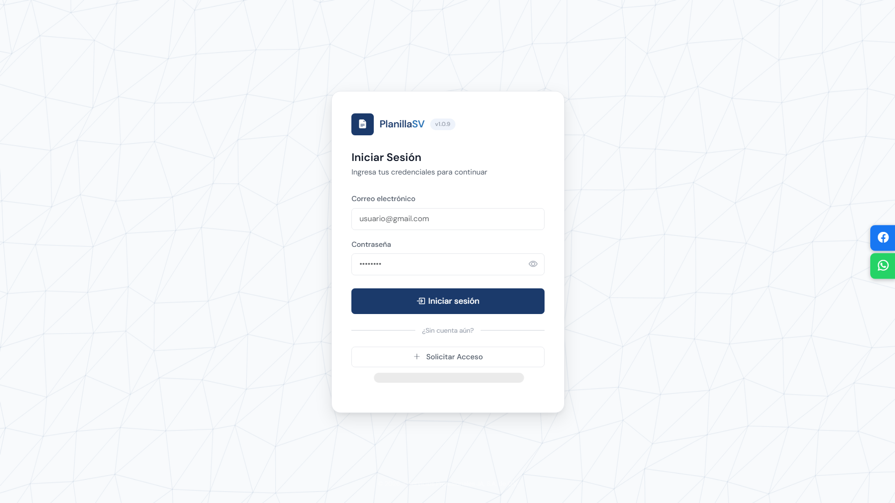
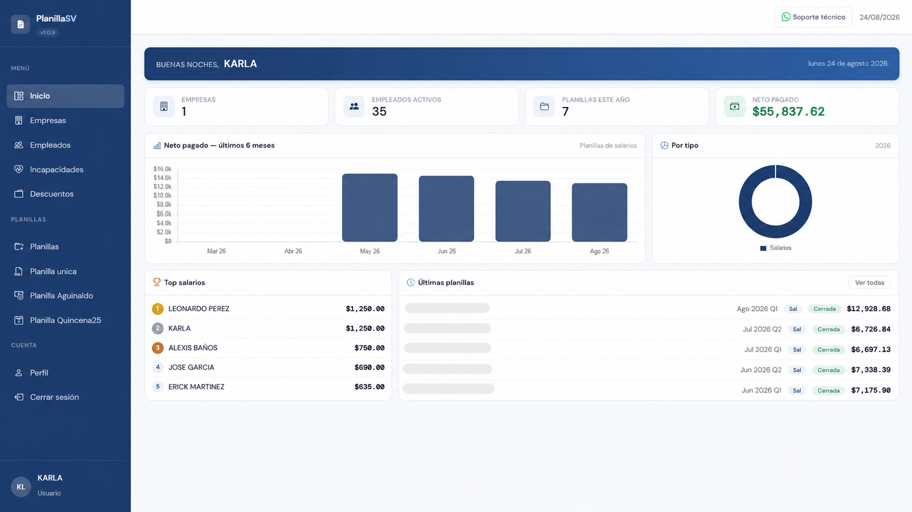
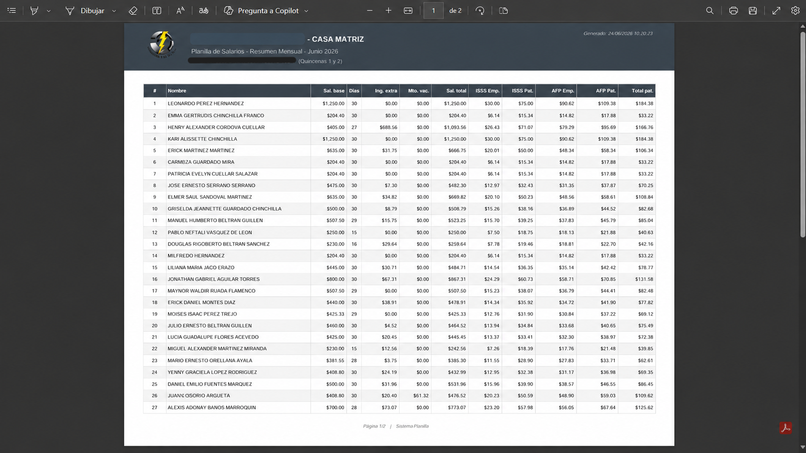

# SistemaPlanilla (PLANILLASV) — SaaS de planillas para El Salvador

> 🔒 **Case study.** Este repositorio documenta un producto comercial en producción. El código fuente es privado; hay demostración disponible bajo solicitud.

**Estado:** 🟢 En producción · **Rol:** Diseño, desarrollo y despliegue completo (proyecto individual)

## El problema

Las pequeñas y medianas empresas salvadoreñas calculan planillas en hojas de Excel: errores en retenciones (ISSS, AFP, renta), boletas hechas a mano y horas perdidas preparando la Planilla Única (SPU). SistemaPlanilla automatiza el ciclo completo de nómina conforme a la normativa laboral y tributaria de El Salvador.

## Funcionalidades

- **Planillas de salarios y honorarios** con cálculo automático de ISSS, AFP, INPEP y retención de renta según tablas legales vigentes
- **Vacaciones** con opciones de 15/18/21 días y prima del 30% configurable
- **Boletas de pago por correo** (envío masivo con reporte de enviados/fallidos y reintento)
- **Generación de archivo SPU** (Planilla Única de El Salvador)
- **Multi-empresa y sucursales**, con gestión de empleados (datos personales, laborales y de seguridad social)
- **Configuración administrable:** departamentos, cargos, tasas legales y códigos de observación
- **Reportes PDF:** planillas en horizontal y boletas individuales (pdf, excel y csv)
- **Gestión de usuarios** con autenticación y control de sesión

## Stack y arquitectura

| Capa | Tecnología |
|---|---|
| Frontend | Bootstrap 5 · JavaScript vanilla |
| Backend | PHP (MVC con Front Controller) |
| Base de datos | MySQL (PDO, utf8mb4) |
| Correo | API HTTP de SMTP2GO |
| PDF | FPDF |
| Hosting | cPanel (producción) |

El backend está organizado en **tres capas** — Controller (rutas y validación de entrada), Handler (lógica de negocio) y Data (acceso a datos con PDO preparado) — lo que mantiene el SQL aislado y la lógica de nómina testeable.

```
api/
├── index.php          # Front Controller / router
├── controllers/       # Endpoints por entidad
├── models/
│   ├── handler/       # Lógica de negocio
│   └── data/          # Acceso a datos (PDO)
└── helpers/           # Config, conexión, validador
```

## Seguridad

- Consultas preparadas (PDO) en toda la capa de datos
- Validación de entrada centralizada
- Endurecimiento de sesión y pruebas locales (login e inyección SQL)

## Capturas





## Lo que aprendí

- Modelar reglas legales cambiantes (tasas, tramos de renta) como datos configurables y no como código
- Migrar el envío de correo de SMTP a API HTTP por restricciones del hosting compartido
- La importancia de las migraciones SQL versionadas al restaurar respaldos de base de datos
- Manejo y resolucion de errores en producción

---

📫 ¿Interesado en una demostración? Contáctame: jhonnyamaya168@gmail.com (ASUNTO: Demo PlanillaSV)
